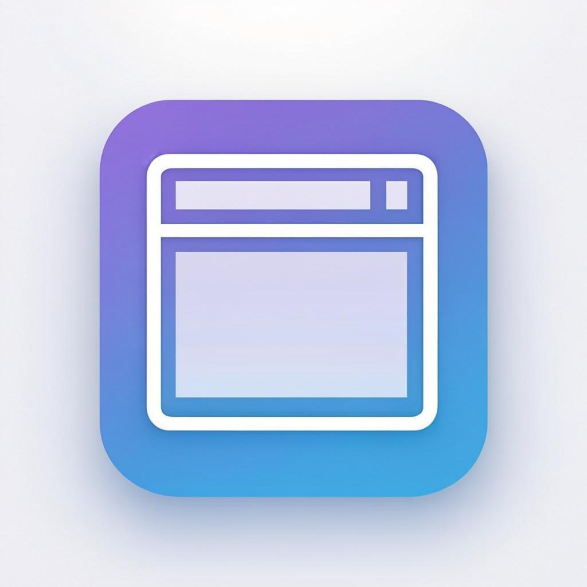
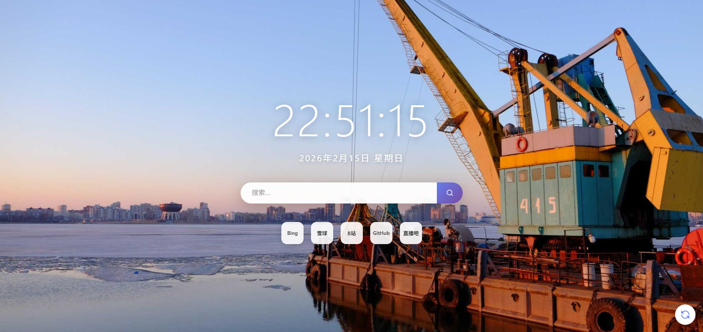

# Moment - 新标签页壁纸扩展

**每次打开新标签页，遇见不一样的风景**

一个简洁优雅的 Edge/Chrome 浏览器新标签页扩展，每次打开都会展示一张随机的高清壁纸背景。

---

## ✨ 功能特性

- 🖼️ **随机壁纸** - 每次打开新标签页自动加载高清随机壁纸
- 🕐 **实时时钟** - 显示当前时间和日期，简洁美观
- 🔍 **快速搜索** - 使用浏览器默认搜索引擎快速搜索
- 🚀 **快捷导航** - 常用网站快捷入口，一键直达
- 🔄 **一键换图** - 点击按钮或按 R 键快速更换壁纸
- ⚡ **轻量高效** - 纯原生实现，无依赖，加载迅速

---

## 📸 预览截图

  

---
